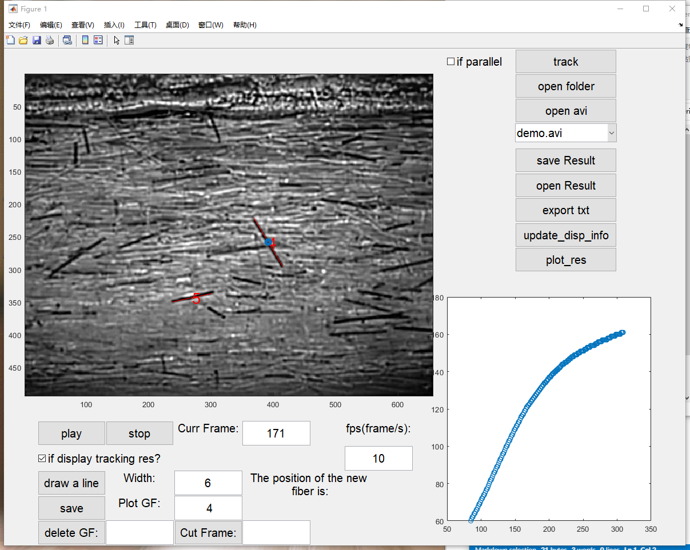
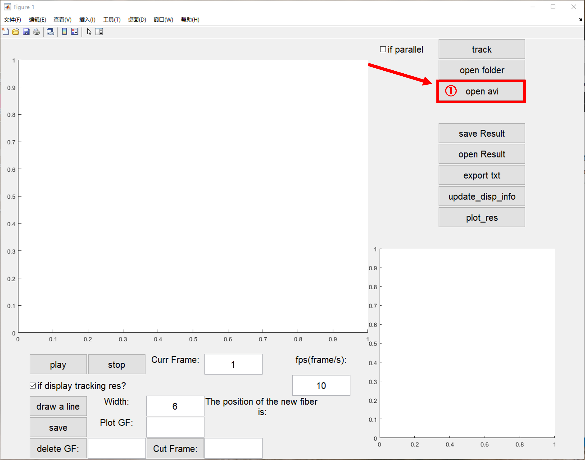
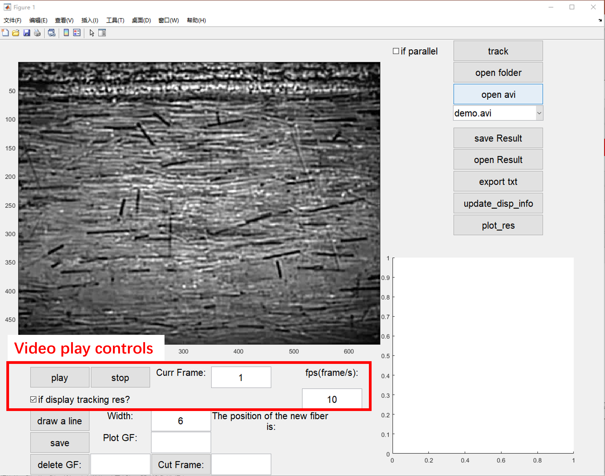
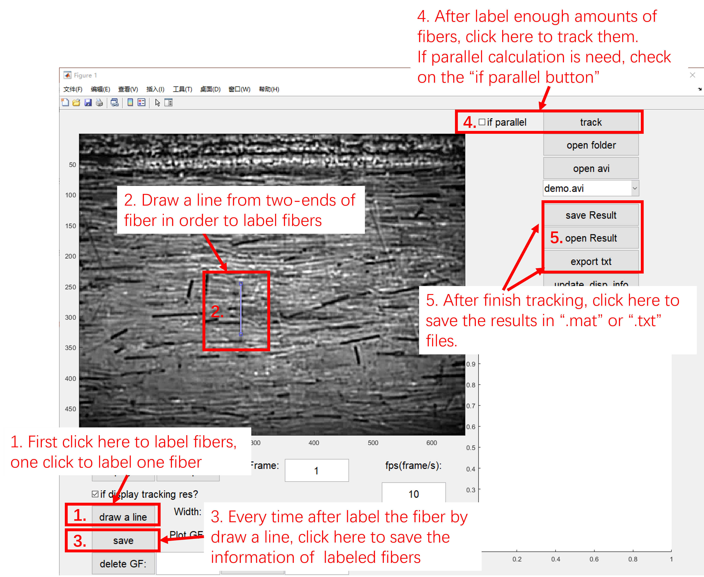
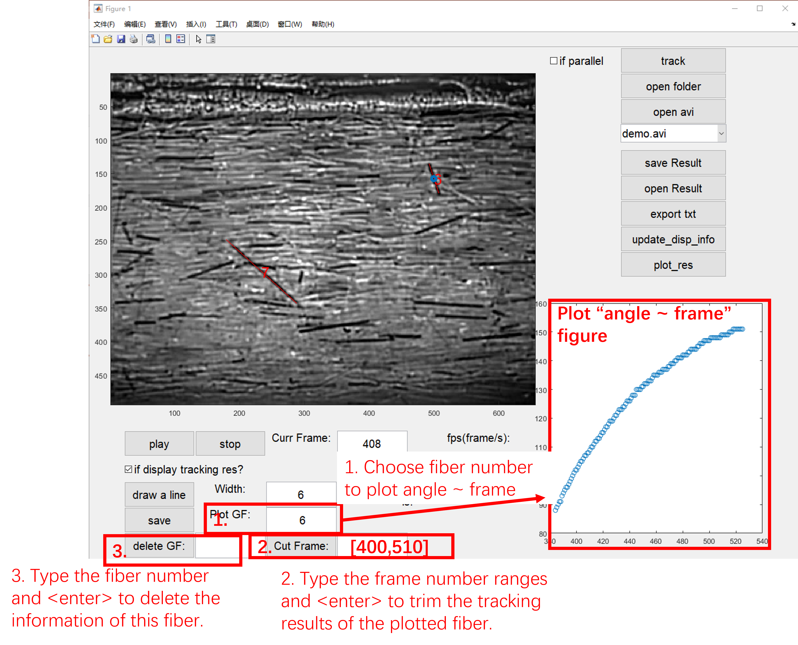

# VideoFiberTrack
 Track fibers for the "Particle Tracking Velocity (PTV)" experiments during rheology and relative studies
## Tracking Fibers' Rotation and Movement in Video Recordings
This package was developped to track fibers for the "Particle Tracking Velocity (PTV)" methods of experiments during rheology studies. 

Author: Dr. Benke Li (李本科)

Author's ORCID: https://orcid.org/0000-0002-8830-0563

Author's ResearchGate: https://www.researchgate.net/profile/Benke-Li

> Please cite these two papers if you use this package:
>
> Benke Li, Ying Guo, Paul Steeman, Markus Bulters, Wei Yu. "Wall effect on the rheology of short-fiber suspensions under shear." __Journal of Rheology__ 2021, 65 (6), 1169–1185.
>
> Benke Li, Wei You, Sijun Liu, Li Peng, Xianbo Huang, and Wei Yu. "Role of confinement in the shear banding and shear jamming in noncolloidal fiber suspensions." __Soft Matter__ 2023, 19 (46), 8965-8977.
>
## Issues and Background
Particle Tracking Velocity (PTV) methods are widely applied in rheology studies of non-Newtonian fluids. During which a small amount of tracking particles was added in the fluids to be captured by the camera, whose trajectories could be represented the fluid's flow fields. 
It is easy to follow the movement of the spherical particles by picture register algorithms, e.g. figure correlations. However, for fiber filled suspensions fluids, due to the invlovlement of fibers' rotation movements, it was hard to tracking the fiber's movement by simply applying the correlation register algorithms. Thus, we developped this package based on `MATLAB` during our studies  [wall effect on the rheology of short-fiber suspensions under shear](https://doi.org/10.1122/8.0000292). Now we open this package based on GPL3 license to benifit relative studies.
## Demo Data and Demo Tracking Results
The demo data and demo tracking results were stored in folder `data` of  this package.
## Usage
This package was tested in MATLAB2023 and MATLAB2016. 

- Start the app

Download this package, and run `main.m` in MATLAB.

- Overview of This package

 - Open Videos, available in '.avi' and '.mp4' type of video

 - Play Videos

 - Label Fibers in the Video and Tracking Them, and Export Results

 - Trim the Tracking Results by Hand if Needed, Delete the Tracking Results by Hand if Duplicated.

